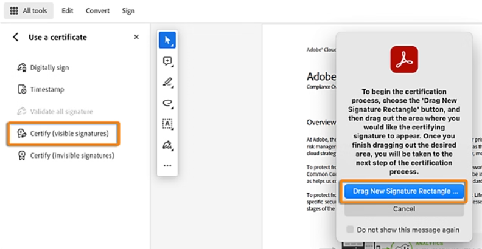
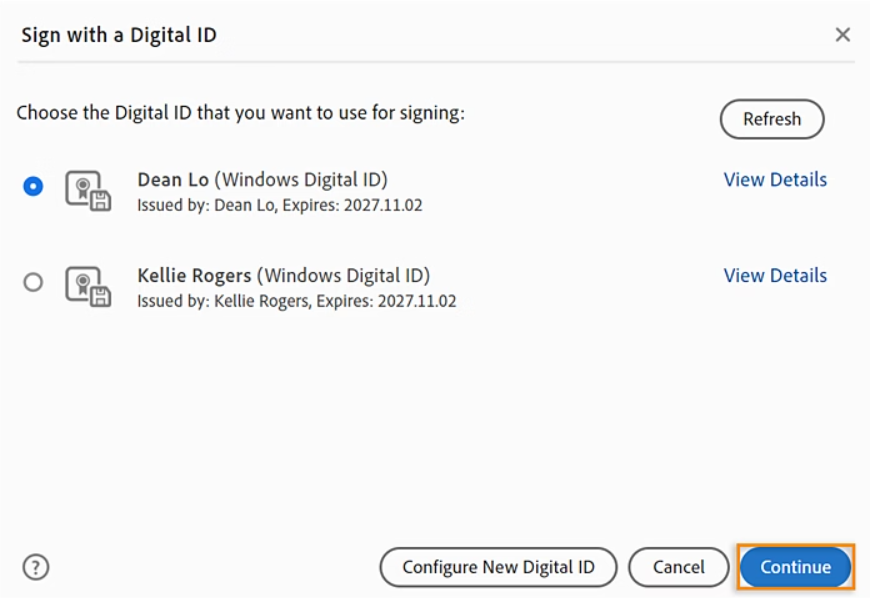
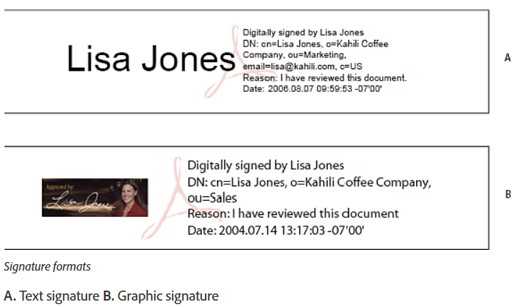

# How to Sign PDFs Using Adobe Acrobat and a Self-Signed Certificate

This guide explains how to use your self-signed `.p12` digital certificate, created with the `create_certificate.sh` script, to sign PDF documents using **Adobe Acrobat Reader** or **Acrobat Pro**.

---

## 🪪 Steps to Add a Certificate-Based Signature to a PDF

### 1. Open the Certificate Tool

- Open a PDF in **Adobe Acrobat**.
- Go to:    
```All Tools → More → Use a Certificate```
- **Alternatively:**  
  From the Acrobat Home screen:    
  ```See All Tools → Protect → Use a Certificate → Select your PDF file```


### 2. Open the "Use a Certificate" Panel

- The **Use a Certificate** panel will appear on the left.
- Choose one of the following options:

| Option                        | Description                                      |
|------------------------------|--------------------------------------------------|
| **Certify (visible signatures)**   | Creates a visible digital signature field       |
| **Certify (invisible signatures)** | Certifies the document without visible signature |

- Then click:
  ```Drag New Signature Rectangle```



### 3. Confirm Certification

- Click **OK** in the **Save as Certified Document** dialog box.


### 4. Define Signature Placement (Visible Only)

- If you selected **Certify (visible signatures)** in step 2:  
  Use your mouse to **drag a rectangle** where the signature should appear on the page.


### 5. Choose a Digital ID

- In the **Sign with a Digital ID** dialog:
  - Select an existing digital ID (e.g. your `.p12` certificate).
  - Or click:
    ```Configure New Digital ID```
    to import or create a new one.




### 6. Review and Sign

- Click **Review** to inspect the document content before signing.
- Click **Sign**.
- Save the document when prompted.

✅ Your PDF is now **digitally certified**.

---

## 🧾 Certifying and Signing Documents

The **Use a Certificate** tool in Adobe Acrobat provides two types of certificate-based signatures:

| Option          | Description                                                                 |
|-----------------|-----------------------------------------------------------------------------|
| **Digitally Sign** | Adds an **approval signature**, indicating that the signer approves the content |
| **Certify**        | Provides a **higher level of control** — certifies the document's integrity and defines allowed changes |


### 🔐 Certify (Visible or Invisible Signatures)

- Certification **must be done before any other signatures** are added.
- Once a document is signed, certification options become unavailable.
- When certifying a document, you can control whether:
  - Changes are allowed (form fill-ins, comments, none, etc.)
  - A visible signature is shown or not.


### ✅ Compliance Standards

Both **Certify** and **Digitally Sign** options are compliant with:

- **ETSI** (European Telecommunications Standards Institute)
- **PAdES** (PDF Advanced Electronic Signature)

> Acrobat and Reader support multiple PAdES parts depending on configuration:
>
> - **Part 2:** Default PDF signing format
> - **Part 3:** CAdES format (optional, can be enabled)
> - **Part 4:** Long-term validation (LTV) and timestamping (supported since Acrobat 9.1)

You can customize the **default signing method or format**:

```Edit → Preferences → Signatures → Creation & Appearance → More...```

---

## ⚙️ Setting Up Certificate-Based Signatures

To improve the signing experience and prevent errors:

### ✅ Preparation Steps

- 📥 **Obtain a digital ID**:  
  Get it from your organization, a trusted provider, or create a **self-signed certificate** (see: `create_certificate.sh`).
  
- ⚙️ **Set the default signing method** in Acrobat Preferences.
  
- 🎨 **Create a visual signature appearance**  
  (see section: *Create the Signature Appearance*)

- 🛑 **Use Preview Document mode**  
  Prevents hidden dynamic content from misleading you into signing something you can't see.  
  
- 📄 **Review all pages**  
  Signature fields can exist on multiple pages — don’t miss any.

- 🧩 **Configure the application**  
  Both the **author and signer** should set up Adobe’s signature environment properly  
  (see: *Set Signing Preferences* below).

- 📝 **Choose the signature type**  
  Understand the difference between **approval** and **certification** signatures.

📎 *Note: Some organizations require digital IDs issued only by internal authorities.*

---

## 🛠️ Set Signing Preferences

Signing preferences define what happens when the signature dialog opens. These control:

- Which actions are allowed or restricted
- Visibility of signature field data
- How document content can influence the signature process

🧭 Go to:
```Edit → Preferences → Signatures → Creation & Appearance → More...```

For enterprise-level control and configuration, refer to:  
**Adobe Digital Signatures Guide** (PDF link available on Adobe's site)

---

## 🖊️ Create the Appearance of a Certificate-Based Signature

You can customize the **visual look** of your certificate-based signature in Acrobat’s **Signature Preferences**. This allows you to include:

- An image of your handwritten signature
- A company logo
- A photo or stamp
- Additional signer information (reason, contact, etc.)

You can also create **multiple signature styles** for different purposes.





### ✨ How to Create a Custom Appearance

1. *(Optional)* Scan your **handwritten signature** and save it as an image (e.g. PNG or JPG).
2. Open the PDF and **right-click** on the signature field →  
   ```Select `Sign Document` or `Certify with Visible Signature` ```
3. In the Sign dialog box, find the **Appearance** drop-down menu and select:
   ```Create New Appearance```
4. In the **Configure Signature Appearance** dialog:
   - Type a **short, descriptive name** for this appearance (e.g. "Tigran Handwritten Logo").

### 🖼️ Configure Graphic

Choose how the graphic appears in the signature box:

| Option           | Description                                                                 |
|------------------|------------------------------------------------------------------------------|
| **No Graphic**   | Displays only text fields and the default icon                              |
| **Imported Graphic** | Shows your custom image (handwritten signature, logo, etc.)                 |
| **Name**         | Displays only the icon and your name (from the certificate)                 |

If using **Imported Graphic**:
- Select `File` → `Browse` → choose your image file


### 📝 Configure Text

You can choose which text fields will appear:

- **Name, Organization, Country** (from your `.p12` / certificate)
- **Reason for signing**
- **Location**
- **Contact information**

These fields can help **verify the authenticity** and purpose of the signature.


### 🧩 Text Properties

In the same dialog box, you can also:

- Set **text direction** (LTR or RTL)
- Choose **digit format**
- Adjust layout

If the dialog includes **Additional Signature Information**, fill in:

- Reason
- Location
- Contact info

> These options are only available if previously enabled in:
>
> ```Preferences → Signatures → Creation & Appearance → More...```


### 📎 Access Preferences Anytime

You can also create or edit signature appearances via the menu:

- On **Windows**:
  ```Hamburger menu (☰) → Preferences → Signatures```
- On **macOS**:
  ```Acrobat → Preferences → Signatures```

Then go to:
```Creation & Appearance → More...```

---

## 🔐 PKCS#12 Modules and Tokens

You can manage **multiple digital IDs** for different signing roles or purposes — for example:

- Signing as an individual
- Signing on behalf of a company
- Using different methods (e.g. visible vs invisible certification)

Digital IDs are typically **password-protected** and can be stored in various locations:

| Storage Type            | Description                                           |
|-------------------------|-------------------------------------------------------|
| **PKCS#12 file (.p12)** | Local file on your computer (default for this toolkit) |
| **Smart card / token**  | External hardware (e.g. USB-based identity devices)   |
| **Windows certificate store** | System-level certificate manager (Windows only)     |
| **Roaming ID**          | Hosted on a server — used in enterprise environments  |

🛠 Adobe Acrobat includes a **default signature handler** that supports IDs from all of the above.

📌 To use a certificate, make sure it's **registered** and visible inside Acrobat (via Preferences → Signatures → Identities).

---

## 🕒 Add a Timestamp to Certificate-Based Signatures

You can include a **timestamp** in your certificate-based signature, showing **exactly when** the document was signed. Timestamps help:

- Prove when the signature was created
- Reduce risk of invalidation due to expired certificates
- Assist in long-term validation

### 🕹 Where the Timestamp Comes From:

| Source                    | Behavior                                                                 |
|---------------------------|--------------------------------------------------------------------------|
| **Trusted Timestamp Authority (TSA)** | Preferred — secure and verifiable via a third-party certificate        |
| **Local system time**     | Used if no TSA is configured — may be unreliable for legal verification |

🖊️ The timestamp appears:
- In the **signature field** itself
- In the **Signature Properties** dialog, under the **Date/Time** tab

---

### 📝 Notes:

- You can configure Acrobat to use a TSA (Preferences → Signatures → Timestamping).
- If no timestamp server is set, Acrobat will use your computer’s local time.
- **Missed it?** You can **add a timestamp later** to a signature  
  → See: *Establish long-term signature validation*

