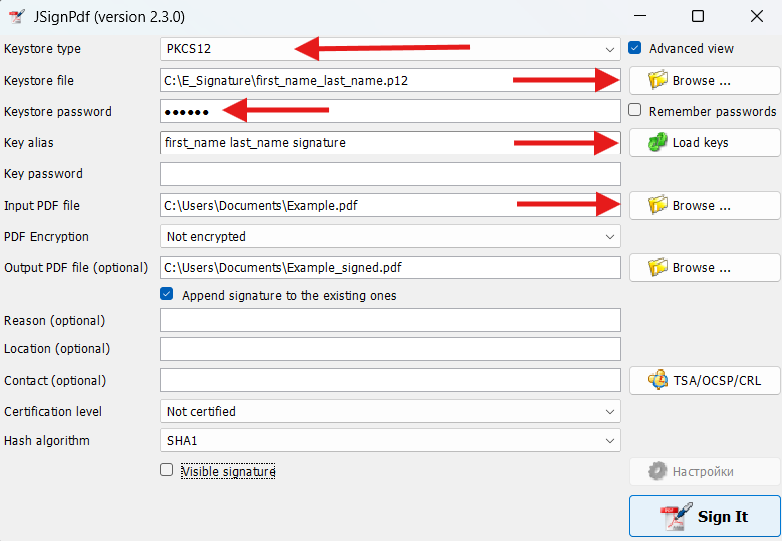
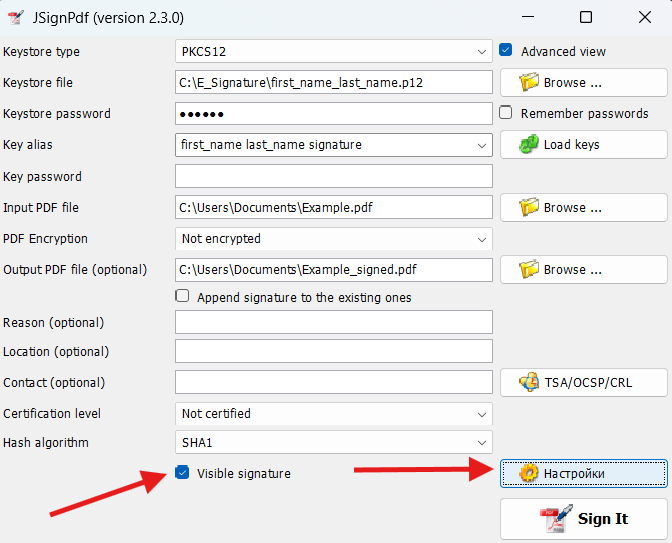
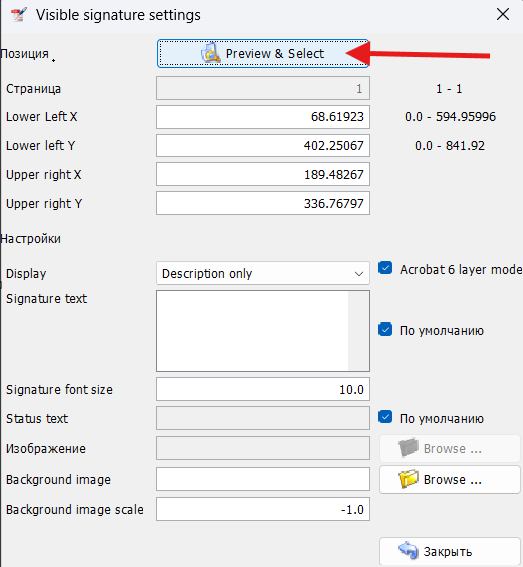
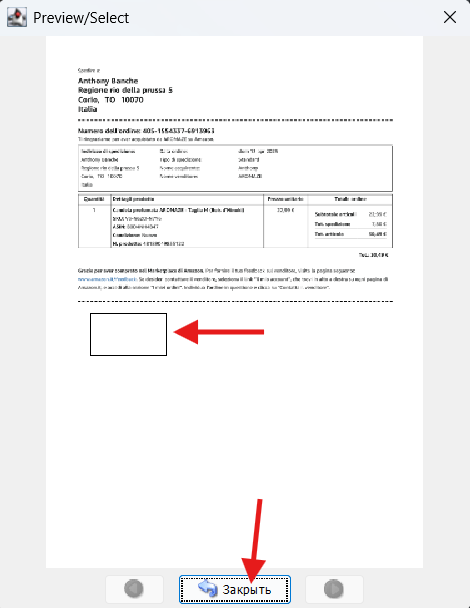
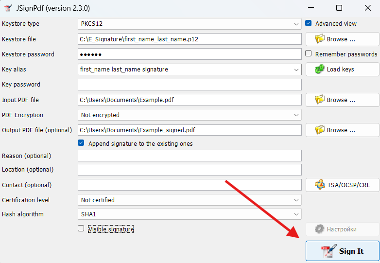
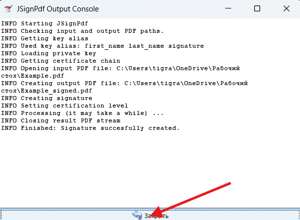

# How to Sign PDFs Using JSignPdf

This guide explains how to use a self-signed `.p12` certificate generated by this toolkit to digitally sign PDF documents using [JSignPdf](https://jsignpdf.sourceforge.net/).

---

## 🔧 Prerequisites

- Java 8+ installed (`java -version`)
- JSignPdf downloaded:
  - [JSignPdf .jar version (GUI/CLI)](https://sourceforge.net/projects/jsignpdf/files/)
  - or use the `.exe` version on Windows
- `.p12` file generated using `create_certificate.sh`

---

## 🖱️ GUI Mode (Recommended for most users)

### 1. Launch the application

If using the `.jar` file:

```
java -jar JSignPdf.jar
```

### 2. Fill in the fields

| #|Field                 |Value                                                  |
|- |--------------------- |-------------------------------------------------------|
| 1|**Keystore type**     | `PKCS12`                                              |
| 2|**Keystore file**     | Path to your `.p12` file (e.g. `first_last.p12`)      |
| 3|**Keystore password** | The password set in `P12_PASSWORD` in the script      |
| 4|**Key alias**         | Click `Load Keys` or Enter manually: `"First_Name Last_Name Signature"`    |
| 5|**Key password**      | Leave blank (unless you set one explicitly)           |
| 6|**Input PDF file**    | Path to the PDF you want to sign                      |
| 7|**Output PDF file**   | Name for the signed output file (e.g. `signed.pdf`)   |

### 📷 Example: JSignPdf GUI setup



### 🖼️ 4. Add a **Visible Signature** (Optional)

To display a visible signature block (like a stamp or label) on a page of the PDF:

---

**1. Enable visible signature**

- Check the box: `visible signature`
- This will activate the **"Settings"** button.



**2. Open visual signature settings**

- Click the **"Settings..."** button to open the signature configuration window

**3. Click `Preview & Select`**



- In the settings window, click the **`Preview & Select`** button
- This will open a visual preview of the PDF
- Select the **page and area** where you want the visible signature to appear by dragging a rectangle



📸 You can use zoom or scroll to position it precisely.

**4. Click `Close`**

- After selecting the area, click the **`Close`** button to return to the settings window
- Your selected coordinates will be filled in automatically

**5. (Optional) Fill additional fields**

- **Reason**: e.g. “Contract Approval”, “Verified”, etc.
- **Location**: e.g. “Lyon, France”
- **Contact**: your name or email
- **Image**: (optional) add a `.png` or `.jpg` of your scanned signature or company logo

**6. Click `OK` to save visual settings**  
You'll return to the main screen.

📌 **Tip**: You can always reopen the Visual Appearance tab and adjust the rectangle again if needed.

### 4. Click **Sign it!** ✅

Click the `Sign it` button.



If everything is correct, your PDF will be signed and saved.



---

## 🧑‍💻 CLI Mode (Optional)

You can also sign a PDF file from the command line:

```
java -jar JSignPdf.jar \
  -ks first_last.p12 \
  -kst PKCS12 \
  -kspwd example-password \
  -alias "First_Name Last_Name Signature" \
  -i input.pdf \
  -o signed.pdf
```

---

## 📌 Notes

- If the certificate is self-signed, Adobe Reader may show a warning until the certificate is marked as trusted.
- You can import the `.crt` file into your local system or Adobe trust store to suppress the warning.
- You can customize the visible signature position and appearance in the GUI using the "Visual Appearance" tab.

---

## ✅ Bonus: Add trust in Adobe Acrobat

To mark your certificate as trusted in Adobe Reader:

1. Open the signed PDF.
2. Click the signature panel → right-click your name → Show Signature Properties.
3. Click “Show Certificate”.
4. Go to the "Trust" tab → click "Add to Trusted Certificates".
5. Enable trust for "Certified documents" and "Signatures".

This will remove warnings for future documents signed with this certificate.

---
